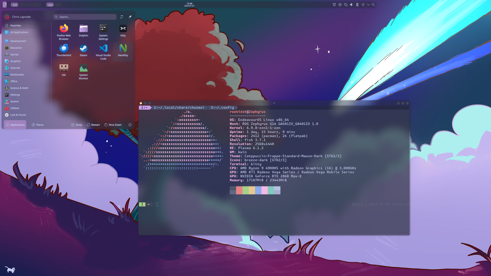
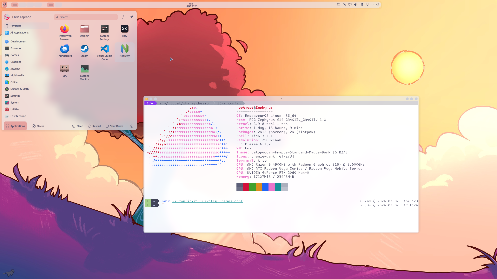
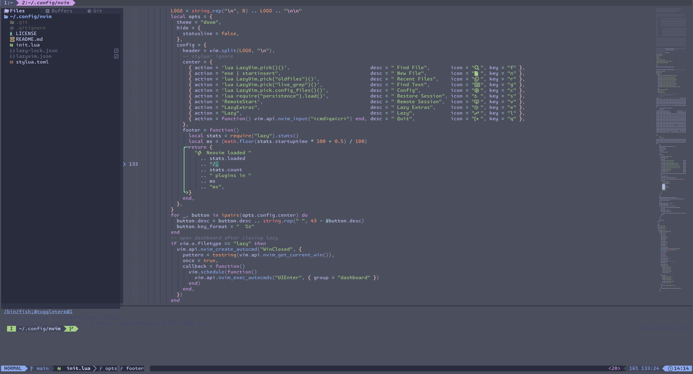
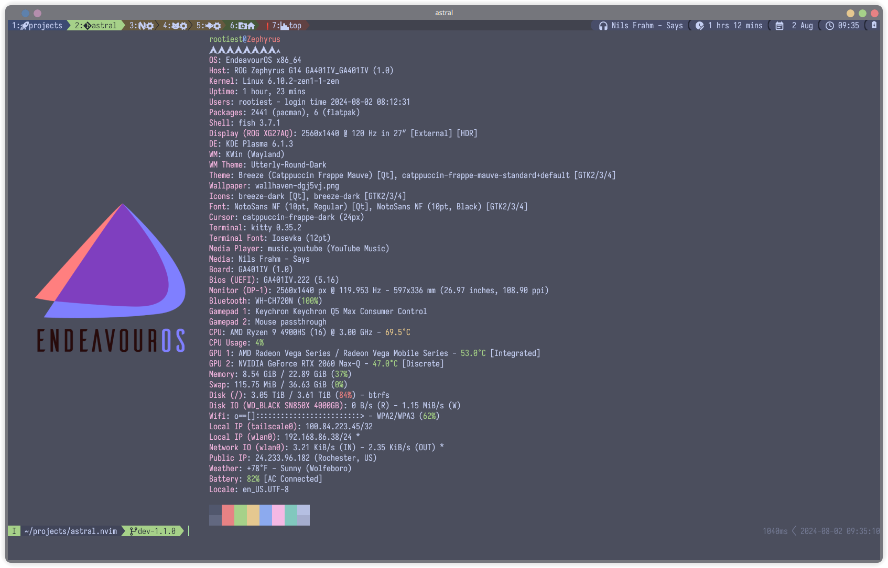

<!-- Rootiest Dotfiles
Copyright (C) 2024  Rootiest Solutions

This program is free software: you can redistribute it and/or modify
it under the terms of the GNU Affero General Public License as published by
the Free Software Foundation, either version 3 of the License, or
(at your option) any later version.

This program is distributed in the hope that it will be useful,
but WITHOUT ANY WARRANTY; without even the implied warranty of
MERCHANTABILITY or FITNESS FOR A PARTICULAR PURPOSE.  See the
GNU Affero General Public License for more details.

You should have received a copy of the GNU Affero General Public License
along with this program.  If not, see <http://www.gnu.org/licenses/>. -->

# Rootiest Dotfiles

```none
 ███████████                      █████     ███                    █████
░░███░░░░░███                    ░░███     ░░░                    ░░███
 ░███    ░███   ██████   ██████  ███████   ████   ██████   █████  ███████
 ░██████████   ███░░███ ███░░███░░░███░   ░░███  ███░░███ ███░░  ░░░███░
 ░███░░░░░███ ░███ ░███░███ ░███  ░███     ░███ ░███████ ░░█████   ░███
 ░███    ░███ ░███ ░███░███ ░███  ░███ ███ ░███ ░███░░░   ░░░░███  ░███ ███
 █████   █████░░██████ ░░██████   ░░█████  █████░░██████  ██████   ░░█████
░░░░░   ░░░░░  ░░░░░░   ░░░░░░     ░░░░░  ░░░░░  ░░░░░░  ░░░░░░     ░░░░░


 ██████████             █████       ██████   ███  ████
░░███░░░░███           ░░███       ███░░███ ░░░  ░░███
 ░███   ░░███  ██████  ███████    ░███ ░░░  ████  ░███   ██████   █████
 ░███    ░███ ███░░███░░░███░    ███████   ░░███  ░███  ███░░███ ███░░
 ░███    ░███░███ ░███  ░███    ░░░███░     ░███  ░███ ░███████ ░░█████
 ░███    ███ ░███ ░███  ░███ ███  ░███      ░███  ░███ ░███░░░   ░░░░███
 ██████████  ░░██████   ░░█████   █████     █████ █████░░██████  ██████
░░░░░░░░░░    ░░░░░░     ░░░░░   ░░░░░     ░░░░░ ░░░░░  ░░░░░░  ░░░░░░


                           █████████████
                       ████
                    █████
                  ███
                ███
               ███
              ███  █
             ███ █
             ████    █
            █████     ███
            ████        █████████
            ████           ████████████               ███
            ███                   █████████        █████
            ████   █           ███   ███████████  █████
             ███   █              █████████████    ███
             ███   █               █    ████████    ██
              ███  █                 █████████████  ██
               ██████                      ██████████
                 █████                        ██████
                  ██████                    ███████
                     █████                ███████
                        ████████ █████████████
                            ██████████████


```

**The Rootiest dotfiles you will ever see!**

## Installation

> **NOTE:** This configures a **complete** Linux environment.

It is strongly recommended to use a fresh install
or backup your existing configuration.

Accompanying tools and packages will be installed automatically.

No pre-requisites are required, just a working internet connection.

### Installation Steps

1. **Install** the Rootiest dotfiles 📜

   This command will both install chezmoi and apply the Rootiest dotfiles.

   ```bash
   sh -c "$(curl -fsLS git.io/chezmoi)" -- init --apply rootiest
   ```

2. Have a coffee ☕️ while the configuration installs.

3. **Enjoy!** 🎉

## Features

A pleasing blend of mouse-driven and keyboard-driven interfaces.

- Integrated [KDE Plasma Desktop](https://kde.org) profile
- Customized [Kitty Terminal](https://sw.kovidgoyal.net/kitty/)
  Configuration
- Customized [Neovim](https://neovim.io/) Configuration
- Customized [Fish Shell](https://fishshell.com/) Configuration
- Custom Rootiest [QMK](https://qmk.fm/) Fork
- Built for comfort and productivity
- [Catppuccin](https://github.com/catppuccin/catppuccin) theme used
  across all applications:
    - Macchiato/Mocha for night mode
    - Latte for day mode
- Other included themes: Tokyo Night, Ayu, and many more
- KDE, NeoVim, wezterm, kitty, fish, tmux, vim, github, and more
- Integrates seamlessly with my other repositories
- Neovim, chezmoi, kitty, fish, and more tightly integrated
- VIM motions are implemented in
  [Neovim](https://docs.google.com/spreadsheets/d/15k_UgeY0C3j8tVQnR2hD_kNljB1AApG3x3gYrKtUAlw/),
  [fish shell](https://fishshell.com/docs/current/interactive.html#vi-mode), and
  [qmk](https://github.com/andrewjrae/qmk-vim).
- Fully customizable Neovim PDE for drop-in development
- Neovim integration with less, scrollback, LazyGit, and more
- Works with any Linux distribution
- Automatic package installation on Arch, SUSE, and Debian based distros
- Integrates with [BitWarden Password Manager](https://bitwarden.com/)
- SSH credential management
- Git credential management
- Git commit signing with GPG
- Encryption with AGE and GPG
- Generates many useful environment variables
- Scripted installation and updates for simple operation

The desktop UI provides a more traditional mouse and keyboard experience
with extensive keyboard mappings to increase productivity.

The development IDE and tools follow similar principles with a much
greater emphasis on keyboard-driven interaction.

## Screenshots

<details>
   <summary>KDE</summary>

Night Mode: (default)


Day Mode:


</details>

<details>
   <summary>NeoVim</summary>



</details>

<details>
   <summary>Kitty and Fish</summary>



</details>

## Trying it out

If you want to try out the configuration without installing it,
you can use the following command:

```bash
sh -c "$(curl -fsLS git.io/chezmoi)" -- init --apply rootiest --dry-run
```

This will show you what would be installed without actually installing it.

## Updating

To update the Rootiest dotfiles,
you can use the following command:

```bash
chezmoi update
```

This will update the configuration to the latest version.

## Companion Repositories

These are included in Rootiest dotfiles, but can be used independently.

[Rootiest Neovim Configuration](https://github.com/rootiest/rootiest-nvim) -
A Neovim config built to work alongside this configuration.

[Rootiest WezTerm](https://github.com/rootiest/rootiest-wezterm) -
A wezterm configuration that is designed to work with this configuration.

[Rootiest Kitty](https://github.com/rootiest/rootiest-kitty) -
A kitty configuration that is designed to work with this configuration.

[Rootiest Fish](https://github.com/rootiest/rootiest-fish-conf) -
A fish configuration that pairs well with this configuration.

[Rootiest Tmux](https://github.com/rootiest/rootiest-tmux) -
A tmux configuration that is designed to work with this configuration.

[Rootiest Iosevka Font](https://github.com/rootiest/rootiest-iosevka) -
A custom Iosevka font that is designed by developers, for developers.

[Nerd Fonts](https://github.com/ryanoasis/nerd-fonts/) -
A collection of fonts that includes many icons and glyphs used in this configuration.

## Credits

- [chezmoi](https://github.com/twpayne/chezmoi)
- [kitty](https://sw.kovidgoyal.net/kitty/)
- [kitty-scrollback](https://github.com/mikesmithgh/kitty-scrollback.nvim)
- [kitty-search](https://github.com/trygveaa/kitty-kitten-search)
- [vim-kitty-navigator](https://github.com/knubie/vim-kitty-navigator)
